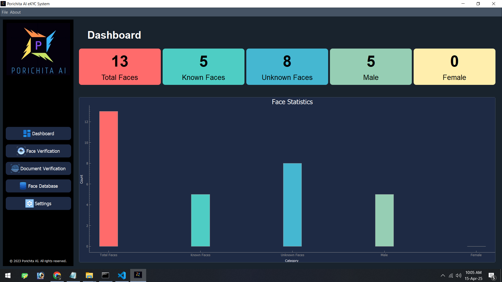
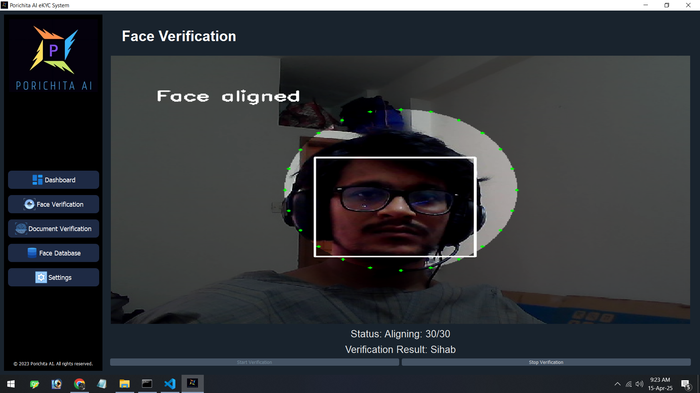
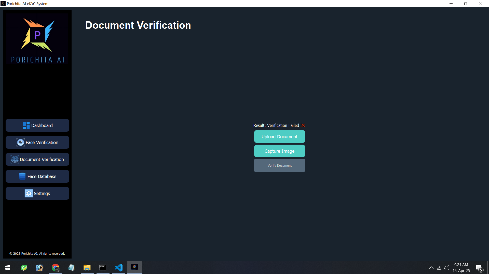
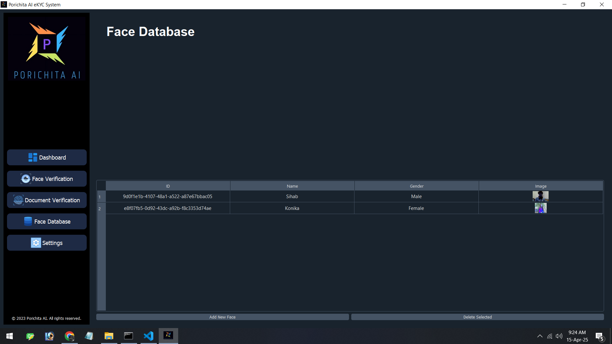
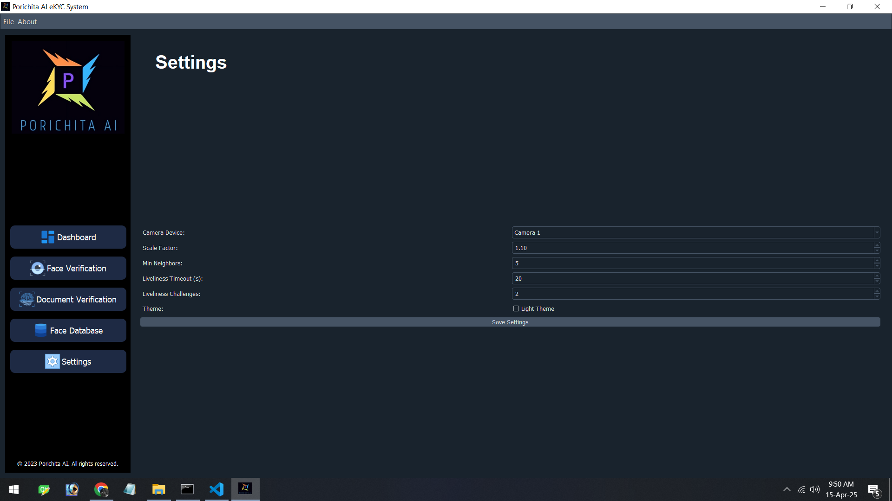

# Porichita AI eKYC System

Porichita AI eKYC System is a Python-based electronic Know Your Customer (eKYC) application for face verification and enrollment. It uses real-time face detection and liveliness testing to ensure secure identity verification, with a user-friendly GUI built on PyQt5. The system supports webcam capture, image uploads, and document verification, storing data in an SQLite database and visualizing metrics on a dashboard.

## Features

- **Face Detection**: Uses MediaPipe Face Mesh for robust, real-time face detection.
- **Liveliness Detection**: Verifies user presence with randomized challenges:
  - **Head Tilt Up/Down**: Detects head pitch (>15° up, <-15° down).
  - **Blinking**: Requires two blinks (eye opening <0.005 normalized units).
- **Face Verification**: Matches faces against a database using DeepFace (Facenet512 model).
- **Enrollment**: Adds new faces via webcam (with liveliness) or image upload.
- **Document Verification**: Compares captured faces with document images.
- **Dashboard**: Displays statistics (total faces, known/unknown, gender breakdown) with a bar graph.
- **Settings**: Configurable camera, liveliness timeout (default 10s), and challenge count (default 2).
- **Database**: Stores face data and verification logs in SQLite (`faces.db`).
- **UI**: Dark/light theme, real-time video feed with alignment ellipse and instructions.

## Prerequisites

- Python 3.8+
- Webcam (for real-time verification/enrollment)
- Internet connection (for initial dependency installation)

## Screenshot







## Installation

1. **Clone the Repository**:
   ```bash
   git clone https://github.com/sihabsahariar/porichita-ekyc.git
   cd porichita-ekyc
   ```

2. **Create a Virtual Environment** (optional but recommended):
   ```bash
   python -m venv venv
   source venv/bin/activate  # Linux/Mac
   venv\Scripts\activate     # Windows
   ```

3. **Install Dependencies**:
   ```bash
   pip install mediapipe opencv-python deepface pyqt5 pyqtgraph qdarkstyle numpy
   ```

4. **Directory Setup**:
   - The system automatically creates:
     - `faces/`: Stores enrolled face images.
     - `Raw Image/Known/`, `Raw Image/Unknown/`, `Raw Image/Enrollment/`: Verification and enrollment images.
     - `faces.db`: SQLite database for faces and logs.
   - Ensure write permissions in the project directory.

5. **Logo and Icons**:
   - Place a `logo.jpg` in `libs/` for the sidebar (or update `EKYCWindow` to handle missing files).
   - Add icon files (`dashboard.png`, `face_verification.png`, `document.png`, `database.png`, `settings.png`) in `libs/` or modify the code to skip icons.

## Usage

1. **Run the Application**:
   ```bash
   python ekyc_system.py
   ```

2. **Interface Overview**:
   - **Dashboard**: View face statistics (total, known, unknown, male, female).
   - **Face Verification**: Verify faces via webcam with liveliness challenges.
   - **Document Verification**: Compare webcam captures with uploaded documents.
   - **Face Database**: Manage enrolled faces (add/delete).
   - **Settings**: Configure camera, liveliness timeout, challenges, and theme.

3. **Face Verification**:
   - Click "Face Verification" → "Start Verification".
   - Align your face in the dotted ellipse (turns green when centered).
   - Follow two random liveliness challenges:
     - **Tilt head up**: Look upward (chin up).
     - **Tilt head down**: Look downward (chin down).
     - **Blink**: Blink twice.
   - Instructions appear on-screen and in the status bar.
   - On success, the system verifies against the database, showing the matched name or "No Match".
   - Results are logged in `faces.db` and update the dashboard.

4. **Enrollment**:
   - Go to "Face Database" → "Add New Face".
   - Choose:
     - **Webcam**: Enter a name, align face, complete liveliness challenges.
     - **Browse**: Upload an image (no liveliness required).
   - Gender is detected (Male/Female/Unknown), and the face is saved in `faces/` and `faces.db`.

5. **Document Verification**:
   - Click "Document Verification".
   - Upload a document image and capture a face via webcam.
   - Click "Verify Document" to compare faces (results shown as Verified/Failed).

6. **Settings**:
   - Select camera device.
   - Adjust liveliness timeout (5–20s) and number of challenges (1–3).
   - Toggle light/dark theme.
   - Save changes to apply.

## Testing

1. **Liveliness Verification**:
   - Start verification and align face in the ellipse.
   - Test challenges:
     - **Tilt Up**: Tilt chin up; ellipse should turn green.
     - **Tilt Down**: Tilt chin down; ellipse should turn green.
     - **Blink**: Blink twice; status updates to "Blink (1/2)" then proceeds.
   - Verify instructions appear and timeout occurs after 10s if ignored (fails with "Liveliness Failed").
   - Check dashboard updates after successful verification.

2. **Enrollment**:
   - Add a face via webcam:
     - Complete liveliness challenges.
     - Verify face is added to `faces.db` and `faces/`.
   - Add via image upload:
     - Ensure liveliness is skipped.
     - Check gender detection and database entry.

3. **Document Verification**:
   - Upload a known face image and capture via webcam.
   - Verify "Document Verified" for matching faces, "Verification Failed" otherwise.

4. **Edge Cases**:
   - **No Face**: Display should show "Align face" if no face is detected.
   - **Photo Spoof**: Hold a photo; liveliness should fail (tilts/blinks not detected).
   - **Poor Lighting**: May fail detection; ensure good lighting.
   - **Database Check**:
     ```sql
     sqlite3 faces.db
     SELECT * FROM faces;
     SELECT * FROM verification_log WHERE status = 'Verified';
     ```

## Project Structure

```
porichita-ekyc/
├── ekyc_system.py       # Main application code
├── faces/               # Enrolled face images
├── Raw Image/           # Verification/enrollment images
│   ├── Known/           # Verified faces
│   ├── Unknown/         # Unmatched faces
│   ├── Enrollment/      # Enrolled faces
├── faces.db             # SQLite database
├── icons/                # Logo and icon files
│   ├── logo.jpg
│   ├── dashboard.png
│   ├── face_verification.png
│   ├── document.png
│   ├── database.png
│   ├── settings.png
├── settings.json        # Configuration file
└── README.md            # This file
```

## Notes

- **Performance**: MediaPipe Face Mesh is lightweight and runs efficiently on most hardware. For low-end devices, reduce webcam resolution:
  ```python
  cap.set(cv2.CAP_PROP_FRAME_WIDTH, 640)
  cap.set(cv2.CAP_PROP_FRAME_HEIGHT, 480)
  ```
- **Thresholds**:
  - Pitch threshold (15°) requires clear head tilts. Adjust in `FaceVerificationThread` if needed:
    ```python
    self.pitch_threshold = 12  # Less strict
    ```
  - Blink threshold (0.005) is tuned for normalized coordinates. Modify for sensitivity:
    ```python
    self.eye_open_threshold = 0.004  # Stricter
    ```
- **Security**: Liveliness challenges (tilts, blinks) prevent photo/video spoofs by requiring dynamic movement.
- **Limitations**:
  - Requires good lighting for reliable MediaPipe detection.
  - Single-face detection (`max_num_faces=1`); extend for multi-face support if needed.
- **Future Enhancements**:
  - Add visual cues (e.g., arrows for tilts).
  - Implement challenge retries.
  - Support advanced liveliness (e.g., smile, head shake).

## Troubleshooting

- **Webcam Not Detected**:
  - Check camera connection and update `camera_index` in Settings.
  - Verify OpenCV backend:
    ```bash
    python -c "import cv2; print(cv2.VideoCapture(0).isOpened())"
    ```
- **MediaPipe Fails**:
  - Ensure `mediapipe` is installed (`pip show mediapipe`).
  - Test with a simple script:
    ```python
    import mediapipe as mp
    import cv2
    mp_face_mesh = mp.solutions.face_mesh
    face_mesh = mp_face_mesh.FaceMesh()
    cap = cv2.VideoCapture(0)
    ret, frame = cap.read()
    if ret:
        rgb = cv2.cvtColor(frame, cv2.COLOR_BGR2RGB)
        results = face_mesh.process(rgb)
        print(bool(results.multi_face_landmarks))
    cap.release()
    ```
- **DeepFace Errors**:
  - Ensure `deepface` is installed and models are downloaded (run verification once to cache).
  - Check internet for initial model download.
- **Database Issues**:
  - Delete `faces.db` to reset (loses all data).
  - Verify write permissions in project directory.

## Contributing

Contributions are welcome! Please:
1. Fork the repository.
2. Create a feature branch (`git checkout -b feature-name`).
3. Commit changes (`git commit -m "Add feature"`).
4. Push to the branch (`git push origin feature-name`).
5. Open a pull request.

## License

This project is licensed under the MIT License. See [LICENSE](LICENSE) for details.

## Acknowledgments

- Built with [MediaPipe](https://mediapipe.dev/) for face detection and liveliness.
- Face recognition powered by [DeepFace](https://github.com/serengil/deepface).
- GUI and visualization using [PyQt5](https://www.riverbankcomputing.com/software/pyqt/) and [PyQtGraph](https://pyqtgraph.org/).
- Dark theme via [QDarkStyle](https://github.com/ColinDuquesnoy/QDarkStyle).

---
*© 2025 Porichita AI. All rights reserved.*